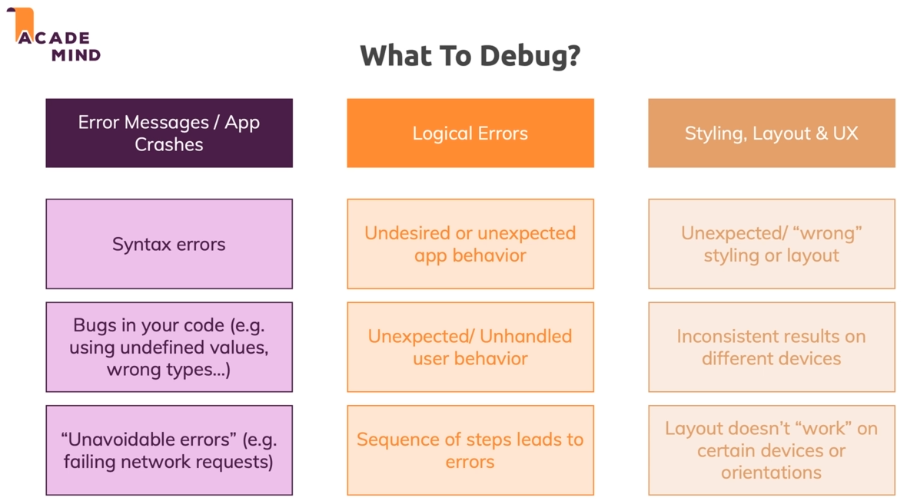

# React Native

## Run app

### Expo Android client

- Very hard to refresh, it rarely updates correctly the new UI and looks as if there are errors.
- Cannot be a reliable source for testing react native app since it still requires verification against an android simulator or browser

### Run in web browser

- Interacting with the React Native app in a web browser can only be debugged using the developer tools of the browser and **NOT** in a terminal.

# React

## Hook

```
The state of these components is completely independent. Hooks are a way to reuse stateful logic, not state itself.
```

Stateful logic is any code that uses state. In the case of hook, it's the behavior created with one or more hooks. (StackOverflow)

[A powerful quick overview on Hooks with detailed use cases](https://academind.com/learn/react/react-hooks-introduction/)

TODO: Watch the video at the beginning of the above article to see how HTTP requests update Hooks

# Javascript

## Spread

Example
```JS
[...goalList, enteredGoal]
```
Add a new element into the snapshot of the current state of the structure prior to update (but not 100% sure that it's immediately prior)

TODO: Read up on Spread (YDKJS)

To ensure that the snapshot of the ```[goalList]``` is of the immediate current state, use this instead:

```JS
goalList => [...goalList, enteredGoal]
```

## Map and React Component

TODO: Read up how map can magically render a React Component for each item in its list

### Exercise 1

TODO: Update the input text to display placeholder text after every press on ```ADD``` button ☑

TODO: Do that without using ```useState("")``` or directly modifying the ```value``` property of ```<TextInput>``` 

## FlatList

FlatList doesn't scroll the entire screen. It has a scroll view within itself.

### renderItem

TODO: explain this in my own word

By default, it should take an object with defined ```key``` or ```id```, but if you want it to extract some key other than those keywords above, you'll need to implement ```keyExtractor```

### Exercise 2

TODO: Prevent the user from adding an empty goal!

## Splitting Components

### Exercise 3

TODO: Split the ```<View>``` for goal input into a separate file without breaking the code! ☑ (half done myself)

When creating new components, create new properties to pass data and methods

e.g.
```JS
<GoalInput onAddGoal={}>
```
Can access whatever passed in by calling ```props.onAddGoal``` inside the component

## Debugging

Common front-end error types


### Tools
- Error messages -> google/stackoverflow
- console.log()
- **Chrome Debugger** (+Breakpoints) triggered by emulator debugger (iOS, Cmd+D; Android, Ctrl+M => debug JS remotely => Ctrl + Shit + I to start Chrome developer tools) => Sources tab => debuggerWorker.js => add breakpoint in the exact js file inside Chrome!

More on [Chrome devtools](https://developers.google.com/web/tools/chrome-devtools/) 

More on [Expo debugging](https://docs.expo.io/workflow/debugging/)

- **Reload Android emulator**: rr (press r twice); iOS: Cmd+R/Ctrl+R

- **Disable Live Reload** while making too many changes to the code at once without wishing to see the red message

- **Enable Hot Reloading** tries to reload only part of the screen affected by the new changes saved without reloading the entire app (live reload) -> still buggy so not enabled by default
  
- **Toggle Inspector**

- **Performance Monitor** enable an overlay with information about the performance in development mode. This is not the final perfomance testing for production mode and should NOT be!

- **Toggle inspector** => UI overlay to inspect elements for their dimensions, colors and so on, but it's better to use the [**React Native Debugger**](https://github.com/jhen0409/react-native-debugger) (download the standalone versions from release tab)

- **React Native Debugger** -> take note of the profiler for optimization by removing redundant/ unnecessary render cycles before publishing app    